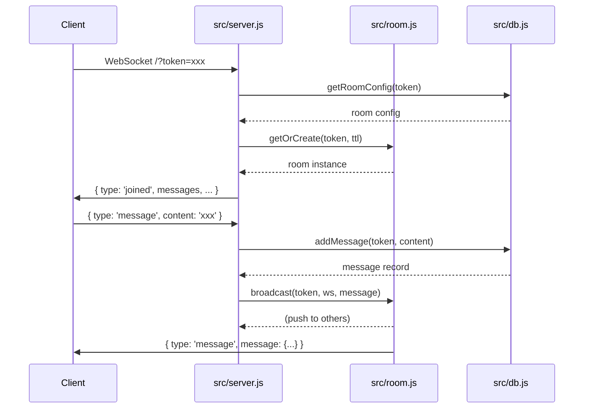

# 系统架构

## 请求流



## 数据流

```
Client ─[WS message/image]─► src/server.js
                                  │
                                  ├─► src/db.js (addMessage/addImageMessage)
                                  │      │
                                  │      └─► persistDB() ─► data/clip-relay.db
                                  │
                                  └─► src/room.js.broadcast()
                                         │
                                         └─► 其他 Client (WS)
```

## 模块依赖

```
src/server.js
  ├─► src/db.js (initDB, addMessage, getRoomConfig, ...)
  └─► src/room.js (RoomManager)
         │
         └─► (纯内存，无外部依赖)
```

## 关键入口

| 入口 | 文件:行号 | 说明 |
|------|----------|------|
| HTTP Server | src/server.js:168 | `http.createServer` |
| WebSocket | src/server.js:373 | `new WebSocket.Server` |
| 连接处理 | src/server.js:375 | `wss.on('connection')` |
| 消息处理 | src/server.js:404 | `ws.on('message')` |
| 清理任务 | src/server.js:523 | `setInterval(cleanupExpired)` |
| DB 初始化 | src/db.js:9 | `initDB()` |
| 持久化 | src/db.js:55 | `persistDB()` |

## 存储流

- **配置**：`config/config.json` (明文) + SQLite `settings` 表 (哈希)
- **消息**：SQLite `messages` 表
- **房间**：SQLite `rooms` 表
- **内存**：`src/room.js` → `RoomManager.rooms` Map